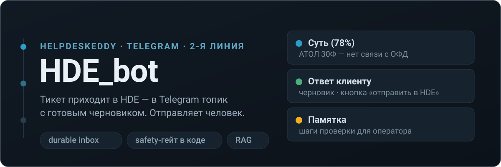
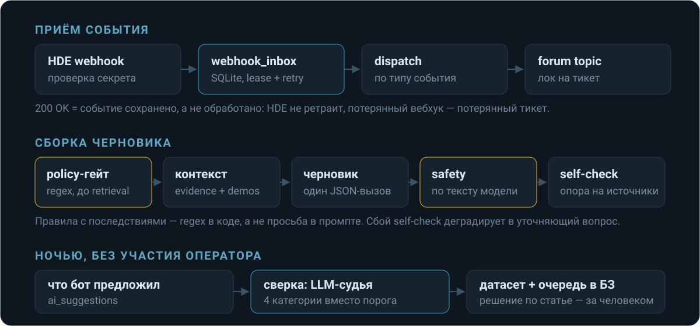

# HDE_bot

Тикет приходит в HelpDeskEddy — в Telegram открывается форум-топик с историей
переписки и готовым черновиком ответа. Отправляет черновик человек.

Бот обслуживает одного специалиста 2-й линии поддержки кассового оборудования
(АТОЛ, Эвотор, Штрих-М, Viki, эквайринг Сбер/ВТБ/Т-Банк).

---

## Что видит оператор

Через несколько секунд после назначения тикета в топике появляются три тихих
сообщения — без звука, у каждого своя аудитория и свои кнопки:

```
🧠 Суть (78%)          АТОЛ 30Ф — нет связи с ОФД, очередь 412 документов
                       [👍 Верно] [👎 Неверно]

💬 Ответ клиенту       Здравствуйте! Проверьте, пожалуйста, горит ли на кассе
                       значок сети… (готовый текст, можно отправить как есть)
                       [👍] [✏️] [👎] [📤 в HDE] [💬 комментарий]

📋 Памятка             1. ping ofd.ru с кассы  2. проверить дату/время
                       3. очередь ФН → отчёт о состоянии расчётов
                       [👍 Полезно] [👎 Бесполезно]
```

Рядом с этим: клиентские фото, видео и голосовые (расшифровываются
автоматически), поля тикета в HDE заполняются сами, за 10 минут до истечения SLA
приходит личный будильник.

---

## Главное ограничение

**Бот никогда не пишет клиенту сам.** Он ассистент оператора, а не автоответчик.
Из этого выводится почти вся остальная архитектура:

- ошибка бота стоит дёшево — её видит человек до отправки;
- зато навязчивость стоит дорого → все AI-сообщения идут без уведомления,
  а «не знаю» — легальный ответ;
- ground truth для обучения — **что оператор реально написал клиенту**,
  а не нажатые в боте кнопки.

Единственное исключение — короткое «я про вас не забыл» перед истечением SLA.
Фактов оно не содержит намеренно.

---

## Как это работает



**Приём.** `200 OK` на вебхук означает «событие сохранено», а не «обработано»:
HDE не ретраит, и потерянный вебхук — это молча пропущенный тикет с идущим SLA.
Событие кладётся в durable inbox в SQLite (lease, попытки, `dead`-алерт),
обрабатывает его воркер.

**Черновик.** Порядок шагов зафиксирован и не случаен:

- **policy-гейт стоит до retrieval.** Если запрос всё равно уйдёт оператору
  (возврат денег, перерегистрация ККТ, удалённый доступ), платить за эмбеддинг
  и поиск незачем — ноль LLM-вызовов.
- **Safety проверяется по тексту модели, а не по её намерению.** «Не обещай
  возврат средств» в промпте — рекомендация, которую модель нарушит; regex в
  коде — инвариант.
- **`evidence` и `demos` разделены.** Статьи и решённые случаи — источник
  фактов, self-check проверяет ответ против них. Похожие диалоговые пары — только
  образец стиля: пара «вопрос → ответ» из чужого тикета не является фактом
  для этого, и self-check, увидев её, подтвердил бы выдуманное.
- **Сбой self-check деградирует в уточняющий вопрос**, а не в уверенный ответ.

**Поиск.** Cosine по локальной `multilingual-e5-large` + BM25 (FTS5), слияние
через RRF. Только вектор проигрывает на кодах ошибок и артикулах, только BM25 —
на перефразированной проблеме. Пустой результат — нормальный исход: блок просто
исчезает из промпта.

**Ночью.** Операторы не жмут кнопки — это выяснилось на проде, и логирование
фидбэка встало ещё летом. Поэтому сигнал берётся без людей: бот сверяет свой
черновик с тем, что оператор реально написал клиенту. Порог косинуса тут не
работает (у e5 несвязанные тексты одного домена дают ~0.8), поэтому судит LLM
и отдаёт категорию: тот же шаг / бот отправил ждать зря / бот соврал факт /
несравнимо. Расхождение по факту встаёт в очередь на статью в базу знаний —
но записывает её человек кнопкой, автоматом никогда.

Полностью: [docs/architecture-2026-08.md](docs/architecture-2026-08.md).

---

## Быстрый старт

```bash
python -m venv .venv
.venv\Scripts\activate          # Windows
# source .venv/bin/activate     # Linux/macOS
pip install -U pip && pip install -r requirements.txt

cp .env.example .env            # заполнить переменные ниже
python start_dev.py             # поднимает ngrok и запускает бота
```

Минимальный `.env`:

```env
BOT_TOKEN=
GROUP_CHAT_ID=            # группа с топиками (ID отрицательный)
PERSONAL_CHAT_ID=         # Telegram ID оператора

HDE_API_BASE_URL=         # https://company.helpdeskeddy.com/api/v2
HDE_API_EMAIL=
HDE_API_KEY=
HDE_WEBHOOK_SECRET=       # без него процесс не поднимется — это намеренно
HDE_OWNER_ID=             # чьи тикеты обрабатывать

WEBHOOK_HOST=             # https://your-domain.com

GROQ_API_KEY=             # console.groq.com
GROQ_SUMMARY_MODEL=       # id модели, напр. qwen/qwen3.6-27b
AGENT_DRAFT_MODEL=
AGENT_SELFCHECK_MODEL=
DEEPGRAM_API_KEY=         # транскрипция голосовых, опционально
```

**Ни одного id модели в коде — только в env.** Провайдер снимает модели без
предупреждения; в августе так одновременно упали в 404 три захардкоженных id.
Теперь мёртвая модель лечится правкой конфига и рестартом, а на старте её ищет
канарейка и пишет оператору в личку, что мертво и какой переменной чинится.

Отчёт в Google Sheets ходит по UI HDE браузером, поэтому дополнительно:

```bash
python -m playwright install --with-deps chromium
```

---

## Команды

В топике тикета:

| Команда | Что делает |
|---|---|
| `/send текст` | публичный ответ клиенту через HDE |
| `/note текст` | внутренний комментарий |
| `/delete` | удалить своё сообщение из HDE (в ответ на него) |
| `/autofill` | заполнить Окружение / Классификацию / Роль |

В личке с ботом:

| Команда | Что делает |
|---|---|
| `/menu`, `/help` | меню и справка |
| `/status` | активные топики, счётчики pre-SLA |
| `/refresh` | сверить топики с HDE, восстановить пропущенные |
| `/report [YYYY-MM-DD]` | отчёт в Google Sheets |
| `/weekly [YYYY-MM-DD]` | сводка за рабочую неделю |
| `/digest` | утренняя сводка |
| `/vacation 3d`, `/workon` | режим тишины и выход из него |
| `/aisummary on\|off` | включить или выключить AI-подсказки |

Редкие команды обслуживания базы знаний в меню не показываются, но работают:
`/aiknowledge`, `/aimetrics`, `/aiimport`, `/aireindex`, `/aibackfill`,
`/aianalyze`, `/aioptimize`, `/promptrollback`.

---

## Деплой

Один Python-процесс, один event loop, одна SQLite-база.

```bash
git pull && systemctl restart hde-bot
```

Схема применяется на старте идемпотентно (`CREATE TABLE IF NOT EXISTS` +
проверка `PRAGMA table_info` перед `ALTER`). Версий схемы нет — компенсирует
суточный снапшот `VACUUM INTO` в `backups/` (не `cp`: копия файла живой базы
рассогласована с WAL и окажется мусором ровно тогда, когда понадобится).

Готовые файлы: [deploy/systemd/hde-bot.service](deploy/systemd/hde-bot.service),
[deploy/nginx/hde-bot.conf](deploy/nginx/hde-bot.conf). nginx проксирует
`/webhook/hde` на `127.0.0.1:8080`; systemd держит `Restart=always` и watchdog,
который бот пингует сам.

После первого запуска база знаний наполняется так:

```
/aiimport      импорт закрытых тикетов из HDE
/aianalyze     извлечь паттерны решений (3–5 минут)
```

---

## Ограничения, о которые уже спотыкались

- **HDE API: 300 req/min → бан на 20 минут, и он общий на аккаунт** — роняет
  заодно сторонние интеграции. Клиентский троттл держится на 120; массовый
  майнинг живого API и ретрай на бане запрещены.
- **Groq free-tier: TPM 8000** на рабочей модели. Одна генерация подсказки —
  около 5000 токенов, то есть ~1 вызов в минуту. Ночь не помогает: лимит
  per-minute. Отсюда пейсинг во всех батчах и кеш в офлайн-харнессе.
- **Канал внутренней БЗ (Teamly) выключен** — не из-за порога, а из-за
  покрытия: выгрузка сделана для первой линии, а бот обслуживает отдел
  оборудования. Ложная статья хуже отсутствующей.
- **Ночной оптимизатор промпта отключён**, активный промпт настроен руками;
  ручной прогон — `/aioptimize`.
- `docs/ARCHITECTURE.md` описывает состояние на апрель 2026 и устарел;
  актуальный документ — [docs/architecture-2026-08.md](docs/architecture-2026-08.md).

---

## Тесты

```bash
pytest tests/ -q
```

Все офлайн: LLM, HDE и Telegram подменяются через параметры-функции, поэтому
прогон не ходит в сеть и не требует ключей.

---

## Безопасность

- `.env`, `secrets/` и база не попадают в репозиторий;
- вебхук HDE проверяется по секрету, без него процесс не стартует;
- ссылки для майнинга берутся только из ответов операторов, не из клиентских
  сообщений;
- Google Sheets — через service account, не OAuth.
